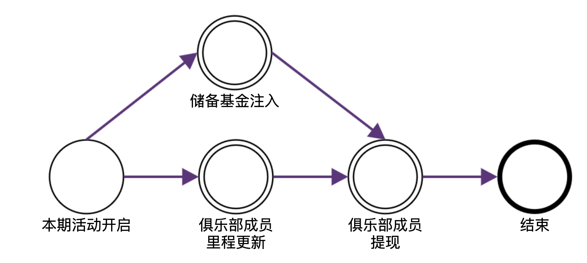

#CyclingDAO 白皮书

- 建立 CyclingFund 智能合约基金
- CyclingDAO identity（作为俱乐部通证身份）
- 每月运动基金（ETH 或稳定币）
- 每周提供个人骑行软件记录，和码表记录，由监理审核后上链
- 每月中旬（15日）结算活动
- 本期基金按骑行里程分配，由成员进行 claim

## CyclingFund 合约

### 概述

CyclingFund 合约是一个包含俱乐部规则的，骑行基金管理工具。合约由储备基金，俱乐部成员 identity，合约管理员等要素构成。

- 储备基金：每月注入一定 ETH/稳定币 作为奖励基金。
- 俱乐部成员 identity：早期使用成员 EOA 账户地址作为成员身份，在一定条件下可提现基金。拥有一定的属性，如：
  - EOA 账户地址
  - 姓名/昵称
  - 总骑行里程
- 合约管理员：对储备基金进行管理，注册/注销俱乐部成员等权限

### 规则

骑行活动在合约中以期次计算。当开启一期活动时，所有注入的储备金皆为本期次活动基金。活动期次由合约管理员设置。

活动期次具有以下属性：

- 期次编号
- 本期储备金额度
- 各俱乐部成员本期里程（默认为空，0）

活动期次具有如下生命周期：



本期次活动开启后，合约管理员可持续多次的注入储备基金，也可以持续多次的更新俱乐部成员里程。

当储备基金和里程更新完成后，合约管理员可调整合约到俱乐部成员提现状态。

在俱乐部成员提现阶段，储备基金和里程锁定。这个阶段，俱乐部成员可提现储备基金，每位成员只能提现一次，成员的提现额度为：

```
提现额度 = 总储备基金 * 成员本期里程 / 所有成员里程总和
```

活动结束后，所有状态清零，储备金返回 owner 钱包。
